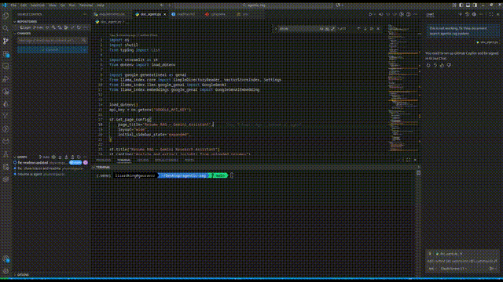

# RAG Pipeline Optimizer — with Claude Sonnet 4

**Find the perfect chunking strategy for your documents — automatically, in seconds.**

A lightweight Streamlit app that runs **4 different RAG pipelines in parallel**, generates answers with **Claude Sonnet 4**, and then lets **Claude itself judge** which pipeline performed best on **your actual documents**.

### The Real MLOps Problem This Solves

Every company today has a RAG system.  
Almost none of them know if theirs is actually good.

- Is `chunk_size=512` better than `1024` or `2048` **for their specific data**?  
- Does more overlap help or hurt?  
- Are they losing accuracy because chunks are too small?  
- Are they wasting latency and tokens because chunks are too big?

Most teams pick a number from a blog post, copy-paste it, and hope for the best.

That’s not engineering. That’s gambling.
---

## Features

| Feature                          | Description                                                                 |
|----------------------------------|-----------------------------------------------------------------------------|
| **4 Chunking Strategies Tested** | Tiny (300), Small (600), Medium (1200), Large (2400) chars + smart overlap |
| **Fully Parallel Execution**     | All pipelines run at the same time (1–4 workers, configurable)            |
| **Local & Free Embeddings**      | `all-MiniLM-L6-v2` runs 100% locally — no embedding API costs              |
| **Claude as Generator & Judge**  | Same model generates answers **and** scores them on Accuracy, Relevance, Efficiency |
| **Automatic Winner Selection**   | Clear table + total score + Claude’s detailed rationale                    |
| **Source Transparency**         | See top retrieved chunks and similarity scores for every pipeline         |
| **One-Click JSON Export**        | Download full results (answers, scores, timings, sources)                  |

Perfect for resumes, contracts, research papers, SOPs, legal docs — any document set where chunk size matters.

---

## How It Works

1. **Upload Documents**  
   Drag & drop one or multiple PDF/TXT files (resumes, reports, etc.).

2. **Enter Your Question**  
   Example:  
   → “What is the candidate’s GPA and semester?”  
   → “List all programming languages mentioned”  
   → “Summarize total years of experience”

3. **Click “Run RAG Optimizer”**  
   The app instantly:
   - Extracts text from your files
   - Builds **4 independent vector indexes** using different chunk sizes
   - Runs semantic search + Claude generation on all 4 pipelines in parallel
   - Sends every answer + retrieved sources + timing data to Claude

4. **Claude Becomes the Judge**  
   Claude evaluates all 4 pipelines and returns structured scores (0–10) for:
   - **Accuracy** – Are the facts correct and complete?
   - **Relevance** – Did it answer the actual question?
   - **Cost/Efficiency** – Speed + number of chunks trade-off

5. **See the Winner Instantly**  
   A beautiful table shows the total score (out of 30) and Claude’s reasoning.  
   You now know exactly which chunking strategy works best **for your data**.

---

## 🛠️ Installation

1. Clone this repository:

```bash
git clone https://github.com/physicistgaurav/agentic-rag.git
```

2. Create and activate virtual environment:

```
python -m venv .venv
source .venv/bin/activate  # Linux / Mac
.venv\Scripts\activate     # Windows
```

3. Install dependencies:

```
pip install -r requirements.txt
```

4. Linux / Windows
pip install faiss-cpu   # or faiss-gpu if you have CUDA

5. Run the Streamlit app
```
streamlit run rag_optimizer_app.py
```


## 🎬 Demo Video



[Watch the demo video](assets/demo.mp4)
